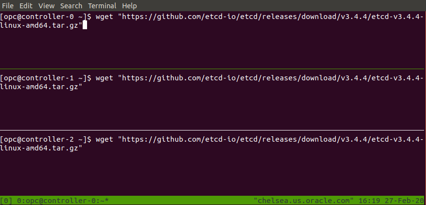

# Prerequisites

## Oracle Cloud Infrastructure(OCI)

This tutorial leverages the [Oracle Cloud Infrastructure](https://www.oracle.com/cloud/) to streamline provisioning of the compute infrastructure required to bootstrap a Kubernetes cluster from the ground up.

## Oracle Cloud Infrastructure(OCI) CLI

### Install the OCI CLI

Follow the OCI CLI [documentation](https://docs.cloud.oracle.com/en-us/iaas/Content/API/Concepts/cliconcepts.htm) to install and configure the `oci` command line utility.

Verify the OCI CLI version:

```
oci --version
```

### Set a Default Region

This tutorial assumes a default [region](https://docs.cloud.oracle.com/en-us/iaas/Content/General/Concepts/regions.htm) has been configured.

If you are using the `oci` command-line tool for the first time `oci setup config` is the easiest way to do this:

```
oci setup config
```

## Running Commands in Parallel with tmux

[tmux](https://github.com/tmux/tmux/wiki) can be used to run commands on multiple compute instances at the same time. Labs in this tutorial may require running the same commands across multiple compute instances, in those cases consider using tmux and splitting a window into multiple panes with synchronize-panes enabled to speed up the provisioning process.

> The use of tmux is optional and not required to complete this tutorial.



> Enable synchronize-panes by pressing `ctrl+b` followed by `shift+:`. Next type `set synchronize-panes on` at the prompt. To disable synchronization: `set synchronize-panes off`.

Next: [Installing the Client Tools](02-client-tools.md)
